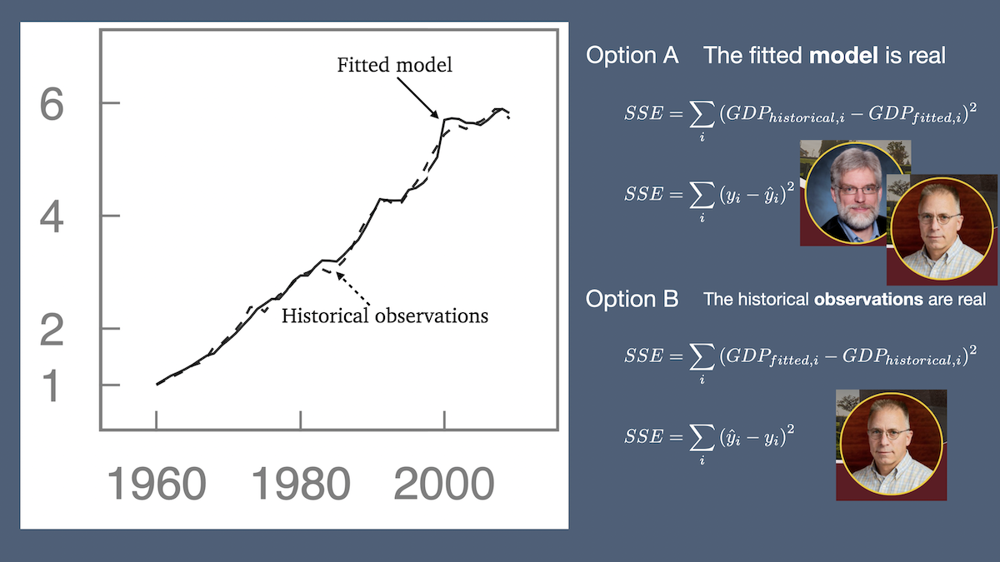

# Conclusion

To conclude, 
I'll quickly circle back to the disagreement 
between Randy and me.
Years ago, I thought Option B was right: 
observations in the concrete, tangible world 
are the real thing. 
Today, I now think that both 
Option A and Option B are right, but 
not because the difference is squared, 
so SSE is the same for both options. 
But rather because engineers need to be able to 
think well abstractly (Option A) and 
be fully aware of the concrete world (Option B)
to be skillful designers. 
And mathematical scientists need to be awesome 
in the symbolic world but also understand 
how their symbolic manipulations affect the concrete world. 
Moving between the concrete and the abstract worlds is messy 
but important and redemptive work! 
Further, I submit that understanding 
both the micro level and the macro level is essential.

{fig-alt="Both options are right."}

Thank you so much for your interest and attention. 
I hope it has been helpful to hear how 
I have come to understand engineering, what engineers do, and
the challenges we collectively face. 

With that, let's declare victory!

Thank you! 
And I'll be happy to take a few questions.
