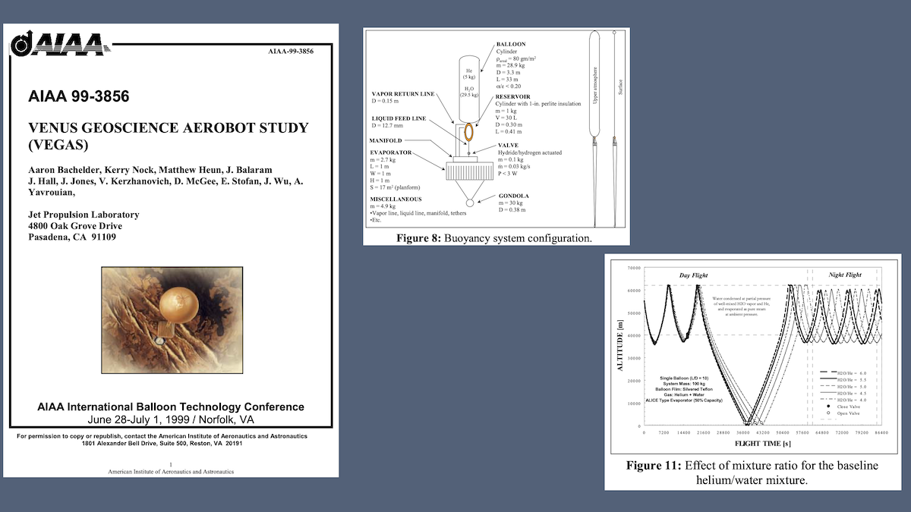
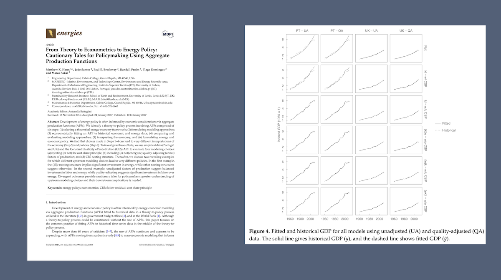
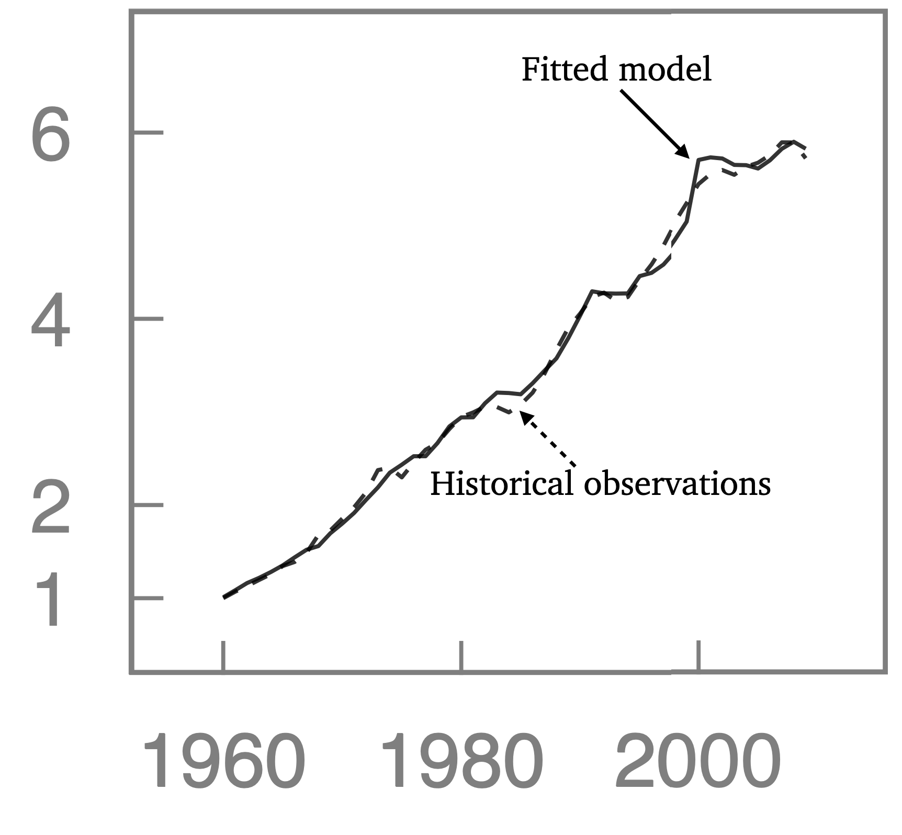
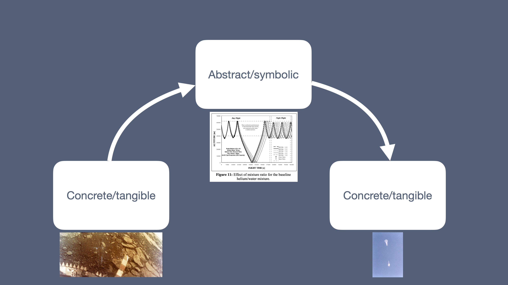

# Creation

The first thing I want you to do
is consider an answer to a question.
Mathematical scientists: 
what is the most interesting or elegant 
solution, derivation, or proof 
you have seen or executed and the problem it solved? 
Engineers: 
what is the most interesting or elegant thing you ever created
and the problem it solved?
I’ll give you a few seconds to quietly think of your answer. 

Those on the end of each row, 
check the color of your sign.
If it's blue, 
raise your hand and point backward 
so everyone in your row can know your direction. 
If your sign is fuchsia, 
raise your hand and point forward so everyone in your row 
can see your direction. 
Again, blue backward, fuchsia forward. 
Those in the center, note your direction. 

This might create a little chaos,
but when I say "go," 
turn around or lean forward and share your answer 
with a person or two in your vicinity.
I’ll give you 1 minute total, so be quick. 
Go!

Thanks for sharing with one another!

Here’s my answer: 

When I worked at NASA JPL in Pasadena, California, 
I was in a group tasked 
to solve the problem of collecting data at the surface of Venus. 
For those who don’t know, Venus is a very interesting, 
but inhospitable, place. 
Interesting, 
because it's very similar to Earth 
in both size and location in the solar system. 
Inhospitable, because of the 

- very dense CO~2~ atmosphere, 
- surface temperature of 460 &deg;C and 
- surface pressure of 92 Earth atmospheres. 

Oh, and the sulfuric acid droplets in the "air."
If the temperature and pressure don’t kill you, 
the sulfuric acid will!

.](images/Venus.png){fig-alt="Venus is an inhospitable place."}

It’s difficult for any machine
to survive at the surface of Venus, 
although the Soviet Union’s Venera 9 
did for a grand total of 53 minutes in 1975, 
sending back the first image 
taken on the surface of another planet. 
The first color images were taken by Venera 13. 

.](images/Venera-lander.jpg){fig-alt="Venera 13 lander." width=80%}

 and [Reddit](https://www.reddit.com/r/spaceporn/comments/2053hh/a_panoramic_view_of_the_surface_of_venus_from_the/).](images/Venus-surface.png){fig-alt="The surface of Venus."}

The solution we designed was a 
gold-plated zylon ballon system 
that would fly about 50 km 
above the surface of Venus, 
descending periodically to take photos and 
collect in-situ data at or near the surface. 
The machine used a mixture of helium and water 
whose boiling and condensation 
would change system buoyancy and, therefore, altitude. 
We called it a “phase-change fluid” (or PCF) balloon system. 

{fig-alt="Phase-change fluid (PCF) balloon system."}

We tested a series of prototype machines 
in Earth’s atmosphere, 
launching from Pasadena and chasing the balloons eastward.

.](images/BARBE2.png){fig-alt="BARBE2 and chase team."}

Engineers call the process of creating new things 
to solve problems _design_: 
deciding sizes, shapes, and materials 
for pieces in a system or machine. 
We engineers design with materials and energy 
from the world around us, 
combining them in original and novel ways. 
We at JPL didn't invent
polymers, gold, helium, or water, but 
we combined them in new ways to be 
the balloon envelope, 
the buoyant gas, and 
the phase-change fluid of our system 
to create a new machine 
to solve the problem of obtaining data 
in the inhospitable environment 
at the surface of Venus. 
In the process, 
our Earth-based prototype 
became the first, and to date only, 
machine of this type to fly successfully.

## Where mathematics and engineering collide

The next thing I want to discuss is how engineers 
go about this designing. 
To do so, I’ll share another story. 
Randy Pruim is the keynote speaker tomorrow, and, 
in case you’re worried, he knows I’m about to do this. 

More than 10 years ago, we began collaborating 
on this paper published in the journal _Energies_. 
The paper contains this figure. 

{fig-alt="Energies paper and Figure 4."}

I’ll zoom in so you can see more clearly. 
Historical observations of GDP are indexed to 1 
in 1960 and shown as a dashed line. 
Fitted model data are shown as a solid line. 

{fig-alt="Detail of Figure 4." width=400}

During our work together, 
we disagreed about the right way 
to calculate the sum of squared errors (SSE) 
between observations and a model or 
between a model and observations. 

Without yet saying who held which view, 
I'll show you the two options we debated. 
And by the way, 
although I remember this disagreement in vivid detail
more than a decade later, 
I’m not bitter. 
And, as David Letterman used to say, 
this only an exhibition; 
this is not a competition. 
Please, no wagering on who was right.

Option A is this: 
the sum of squared errors is the sum over 
all historical observations (i) 
of the square of historical GDP less fitted GDP.

$$
SSE = \sum_i{(GDP_{historical,i} - GDP_{fitted,i})^2}
$$

Option B is the sum over all historical observations 
of the square of fitted GDP less historical GDP.

$$
SSE = \sum_i{(GDP_{fitted,i} - GDP_{historical,i})^2}
$$

I also include versions of the equations 
with the typical nomenclature found in textbooks: 
$y$ and $\hat{y}$. For Option A:

$$
SSE = \sum_i{(y_i - \hat{y}_i)^2} \, .
$$

For Option B:

$$
SSE = \sum_i{(\hat{y}_i - y_i)^2} \, .
$$

The question to you is this: 
which option is right, 
Option A or Option B, and why? 
And no fair sitting on the fence. 
You can't say "it doesn’t matter," 
because it does! 
You must choose one or the other, A or B! 

I’ll give you a few quiet seconds to decide. 

Now comes the second thing I want you to do today. 
Not yet, but 
when I say "go,"
turn around or lean forward and share your answers. 
If you find you disagree, 
make the case that your answer is the right answer. 
If you agree, 
develop arguments for your position and 
against the other option. 
Take 1 minute to discuss 
with the same conversation partners as before. Go!

Thanks for having this discussion! 
Perhaps you can use this question 
as a conversation starter for those awkward times
when you're early to a session and 
find yourself next to someone you don't know.

Before I share more about the disagreement 
between Randy and me, 
I'll share why I think it matters. 

The subtrahend (the term after the minus sign)
is the thing you consider real or correct or true. 
In contrast, the minuend (the term before the minus sign)
is the thing you are testing.

Option A implies that the true GDP 
is represented by the fitted model. 
The historical observations 
are an imperfect and imprecise measurement of true GDP. 
When our observations are too high, 
we have positive measurement error. 
When our observations are too low, 
we have negative measurement error. 
If we had better observations, 
they would conform to the truth of the model.
For Option A, the model is the thing that's real. 

In contrast, Option B suggests that the only thing
we know is our observations 
in the concrete and tangible world. 
Abstract fitted models are meant 
to describe our concrete observations, 
not the other way around. 
When the fitted model is greater 
than an historical observation, 
our model is overpredicting GDP, and 
we have positive model error. 
If the model prediction is less than
an observation in any year, 
our model is underpredicting GDP, and 
we have negative model error.
For Option B, the observations are the thing that's real. 

Randy said (in my recollection, verbatim): 
"The model is the thing that’s real."
I contended that the observations are the thing that’s real. 
Who is right?

## How engineers design

Returning to my example, 
engineers solve concrete, tangible problems 
such as how to collect data at the surface of Venus. 
To do so, we design, using, in part,
calculations and other manipulations 
in symbolic, abstract space, 
represented here by predicted altitude profiles of the 
Venus balloon system.
We bring the results of those calculations and 
symbolic manipulations back into concrete, tangible space 
in the form 
of prototypes, products, or machines that solve the problems.
In fact, in engineering design, 
the abstract and concrete worlds collide! 
We engineers and mathematical scientists move with ease from 
the concrete and tangible space to 
the abstract and symbolic space and back;
repeatedly and often. 

{fig-alt="Moving from the concrete to the abstract and back again."}

Let's try it here. 
Answer this question to the person you're sitting beside. 
What’s this? 

.](images/Roman-Colosseum.png){fig-alt="The Roman Colosseum." width=80%}

I'm not trying to be insufferable. 
But, well actually, 
it's a projected-light photo of the Roman Colosseum. 
It is an abstract representation of the Colosseum, 
which is a concrete, tangible thing. 
But we are willing to simply say "it's the Roman Colosseum."

If you try this at home, 
the response is likely to be "Why are you being like this?" 
But it just shows that we’re quite adept at leaping
from abstract representations to concrete language. 
The line between model and physical thing is blurry. 
In fact, it's so blurry, we often don’t notice it. 
Or at least in our language, 
and therefore in our thinking, 
the image on the screen really is the Colosseum, 
not an abstract representation,
not a pho*to*, not pho*tons*!

Moving between the concrete and the abstract 
is the basis of mathematics. 
Developing abstractions is the goal of computer science! 
And the skill enables engineering design. 

## Implications of human creating

Moving between the concrete and the abstract is natural 
if you know how to do it, 
if you know how to think well abstractly. 
But not everyone can! 
And we’re not born with this ability.

Here is a photo of some people who can’t think abstractly very well at all.

.](images/bunching-soccer-players.jpg){fig-alt="Children bunching around the ball." width=80%}

When young children learn to play soccer, 
it's still all about "me." 
They all want the ball. 
Ideas of "self," "other," and "team" are nascent. 
There is little ability to think about things 
from another physical perspective, 
say from above one's self where 
one could see that players from both teams 
are bunched around the ball. 
Because of their developmental level, 
it is folly to expect these people to "spread out,"
regardless of how many times coaches or parents implore. 

The ability to think deeply abstractly 
is one of the last skills that the human brain develops. 
Eventually, some of these kids 
might grow up to play for Liverpool or Real Madrid 
in the Champions League final in May 2022. 

: [Liverpool](https://www.liverpoolfc.com) 0--1 [Real Madrid](https://www.realmadrid.com/en-US). Source: screen shot from tactical camera footage available on [YouTube](https://www.youtube.com/watch?v=oXn0KPPHzuY).](images/Champions-League-Final-2022.png){fig-alt="May 2022 UEFA Champions League final; Real Madrid vs. Liverpool." width=80%}

Now here are some people who can think abstractly! 
I'm not bitter about my decade-old dispute with Randy Pruim. 
But I am bitter that Real Madrid's goalkeeper 
[Thibaut Courtois](https://en.wikipedia.org/wiki/Thibaut_Courtois)
had the game of his life
that night to deny Liverpool the title!

Indeed, the more abstract a subject, 
the harder it is for students who are still developing
their abstract-thinking skills. 
Similar to the kids who bunch together on the pitch, 
it is folly for me to expect my students 
to be mature designers who navigate with skill
between the concrete and the abstract. 
Nonetheless, we teachers bring students 
along a developmental path from 
bunch ball to the Champions League final. 

But from those who _can_ navigate 
between the concrete and the abstract skillfully, 
what about the process of designing 
to solve problems? 
What can we learn from it?

We've all heard sermons on Genesis 1:27. 
"So God created humankind in his own image &hellip;" 
The verse is summarized by the Latin phrase, 
_imago Dei_, and 
the substantive interpretation of Genesis 1:27 
holds that we humans share some of God's characteristics. 
I submit that God created, 
so we humans 
(engineers, artists, sculptors, playwrights, mathematical scientists), 
we create. 

As you know, 
there is a very important difference between 
human creating and God's creating. 
Hebrews 11:3 says, 
"By faith we understand that the universe was formed 
at God's command, 
so that what is seen was not made out of what was visible."
In distinction to the Creator who made the universe 
out of nothing 
(summarized by more Latin, _ex-nihilo_), 
we humans create from what we find around us. 

But our creating is closer to _ex-nihilo_ than you might think. 
The opening lyrics of Peter Gabriel's 1986 song 
"[Mercy Street](https://www.youtube.com/watch?v=3LJUIIESgpQ)" 
summarize this nicely.

> Looking down on empty streets, all she can see  
> Are the dreams all made solid, are the dreams made real  
> All of the buildings, all of the cars  
> Were once just a dream, in somebody's head  

"Were once just a dream in somebody’s head"
captures the ethereal nature of the original ideas 
from which we create. 
That's from the abstract space. 
Skilled engineers know how to move those ideas 
into the concrete, tangible world. 
Skilled mathematical scientists can convert ideas 
into elegant proofs, functions, or analyses. 
Our creative work can be traced back to 
our being created in God's image, 
albeit with the important distinction that we humans 
don't quite create _ex-nihilo_.

Engineers: think again of the most elegant thing you created. 
Mathematical scientists: think again of the most elegant proof. 
Would anyone have done it exactly the same way as you? 
Probably not. 
What we create reveals us to the word around us, 
just as the creation reveals God. 
We know God, 
because we can see God in God’s handiwork, 
the work of God's hands. 
One of the earliest articulations of the two books idea 
is attributed to Augustine. 
In my own Reformed tradition, 
Article 2 of the 
[Belgic Confession](https://en.wikipedia.org/wiki/Belgic_Confession)
states it thus:

> We know God by two means:  
> First, by the creation, preservation, and government of the universe,  
> since that universe is before our eyes like a beautiful book  
in which all creatures, great and small, are as letters to make us ponder  
> the invisible things of God. &hellip;  
> All these things are enough to convict humans and to leave them without excuse.  
> Second, God makes himself known to us more clearly by his holy and divine Word. &hellip;  

The fact that we are _in_-vested in our designs 
reflects how God is _in_-vested in the creation. 
Of course, engineers are not God, 
nor are we little gods as we go about our work. 
But the parallels between the work of engineers and 
God's activity at creating the universe are striking. 

So, back to the title of my talk. 
Engineering: what are we doing? 

We engineers move between the concrete and the abstract 
and back again to design and create,
reflecting the image of the Creator. 

But human creating is fraught. 
There are several ways it can go wrong. 
