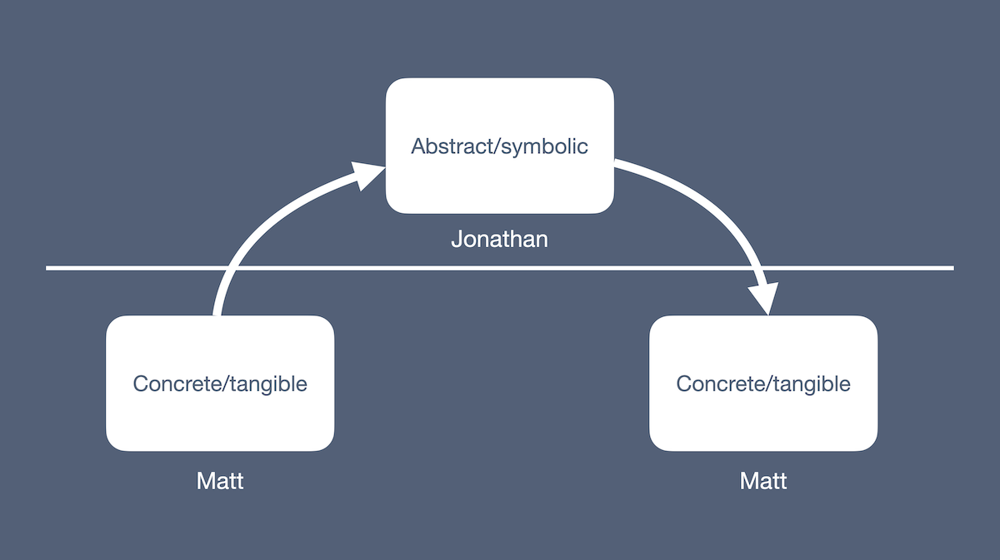
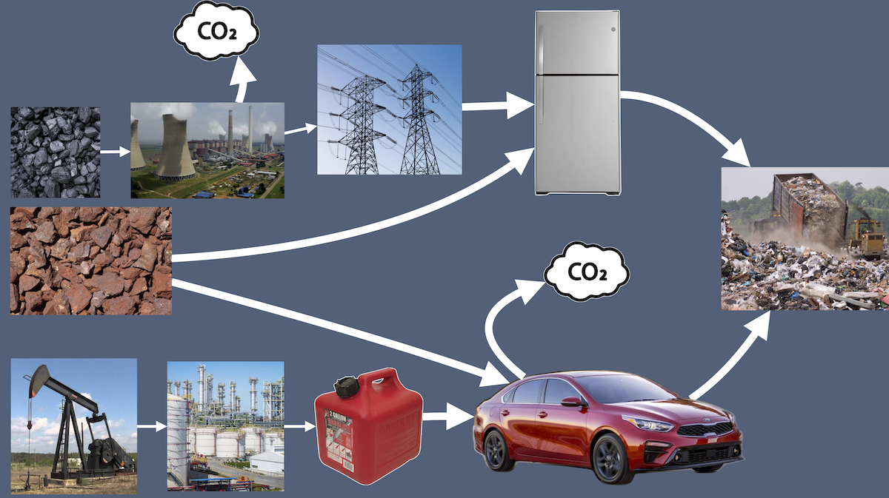
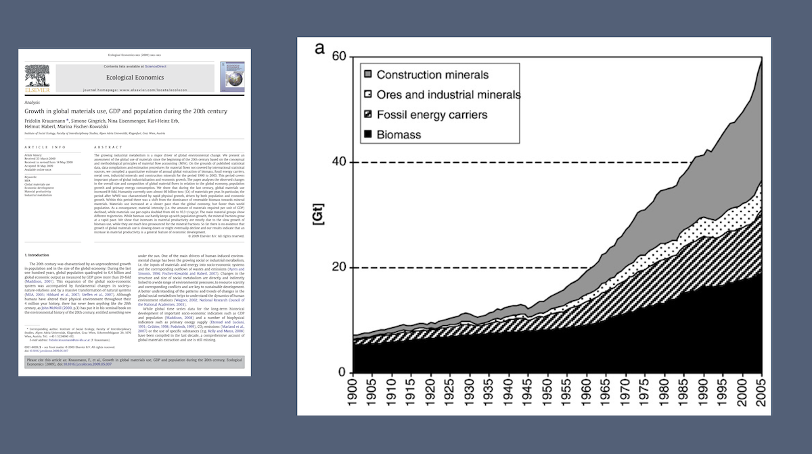
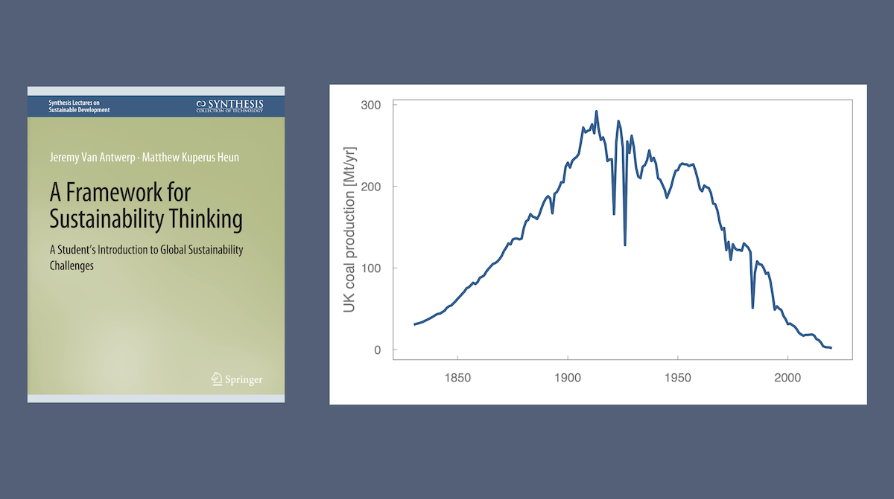
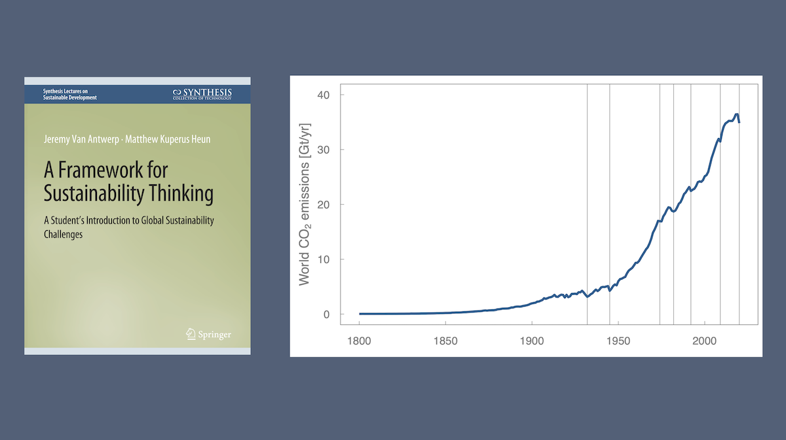
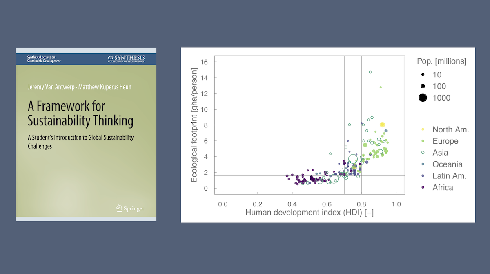
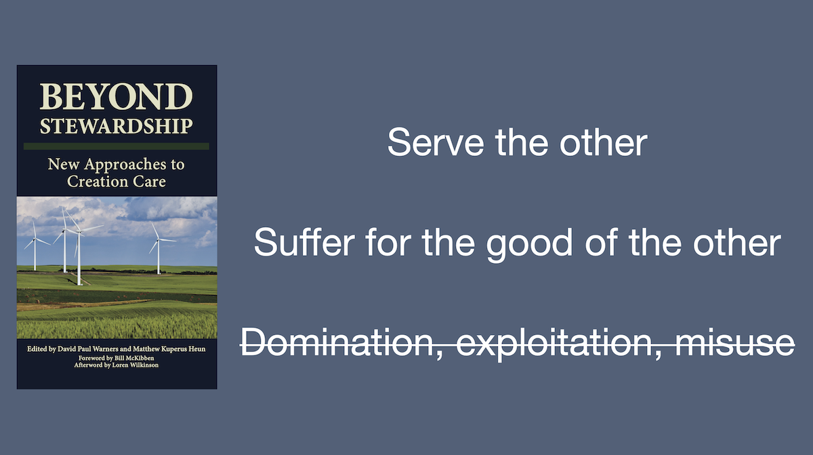

# Problems and the Fall

Here is your last task for today. 
Not now, but when I say "go,"
take 1 minute to answer this question 
with your new friends in front or behind:
what is an example of human creating gone wrong? 
You may want to think of a disaster 
to answer this question. "Go!"

OK. Thanks for that!

I want to discuss a few ways design and creativity 
goes wrong and give some examples to illustrate. 
You can see if you have the same examples as me. 

## Dishonesty, sin, and evil

One category of ways human creating 
can go wrong is dishonesty, sin, and evil; 
as we Christians would call it, the Fall. 
A good (or should I say bad) example 
is the 2015 Volkswagen emissions scandal 
in which engineers programmed engine emission controls 
to activate, shall we say, &hellip; selectively.
The VW Golf met regulatory standards during EPA testing. 
But during real-world driving, 
the cars emitted 40-times 
more nitrous oxides, 
polluting the air and creating smog.

.](images/VW-Golf-TDI-clean-diesel.jpg){fig-alt="VW Golf TDI Clean Diesel that wasn't very clean." width=80%}

When dishonesty, sin, and evil take up residence 
in engineering teams, the results aren’t good. 
11 million cars were involved 
in the falsified emission reports, and 
the cost to Volkswagen has been $33.3 billion.

## Human finitude

But evil is not the only problem 
that occurs when humans create. 
A second cause of problems is human finitude, 
different from the Fall.

In preparation for one flight of the prototype 
Venus balloon system in California, 
my colleague Jonathan and I were both given new roles 
on the team: 
he became the modeling lead, and 
I became the buoyancy system lead. 
Here is the equation for net force on the balloon system 
prior to launch. 

$$
F_{net} = \rho_{atm} \, V_{displaced} \, g
          - (m_{dry} + m_{He} + m_{PCF} ) \, g 
          - m_{FL} \, g = 0
$$

Jonathan ran our trajectory model 
with up-to-date weather data and provided 
a suggested amount of free lift ($m_{FL}$) 
for the flight. 
Now, free lift is the amount of additional mass 
required to achieve neutral buoyancy at the launch site. 
To launch, the free lift mass is removed, 
the net force turns positive, and 
the system ascends. 

$$
F_{net} = \rho_{atm} \, V_{displaced} \, g
          - (m_{dry} + m_{He} + m_{PCF} ) \, g 
          - \cancelto{0}{m_{FL}} \, g > 0
$$

Getting the free lift correct 
for the atmospheric conditions at launch is essential. 
Too little free lift and the system would ascend once, 
turn around, and crash. 
Too much free lift and the system 
would fly through the tropopause and burst, 
thereafter crashing back to earth.
As buoyancy system lead, 
I was to implement on the flight system 
the free lift proposed by Jonathan by adding 
weights ($m_{FL}$)
and adjusting the helium charge  
($m_{He}$) 
until the system was trimmed to neutral buoyancy 
prior to launch.

Maybe you can see where this is going? 
Jonathan oversaw the model 
with which he performed symbolic manipulations 
in the abstract space.
I was responsible for the buoyancy system 
which lived in the very concrete, tangible space at JPL. 
We split responsibilities exactly 
along the lines I’m discussing here! 
We put an interface between us. 
What could go wrong? 

{fig-alt="An interface."}

Plenty! 
We, stupidly in retrospect, 
communicated in units of kilograms 
with the precision of _tens_ of grams. 
We should have been communicating 
in units of grams 
with the precision of _tenths_ of grams 
for an Earth prototype flight. 
Our scales even measured to a tenth of a gram, but 
we didn’t use that setting! 
As a result, we overcooked the free lift 
by a few grams, 
with disastrous effects. 
(Thankfully, the Venusian atmosphere is 
much more forgiving than the Earth atmosphere, and 
the required precision is much less.)

We flushed 70 thousand dollars down the toilet that day. 
It was not my finest hour! 
But for future (successful) prototype flights, 
we did it right.

I'll say it again, 
the process of moving from the concrete and tangible space
to the abstract and symbolic space 
and back again is fraught. 
We weren't evil in our work. 
I don't think the balloon's crash 
was the result of the Fall. 
We simply didn't anticipate the problems 
that could be caused by our lack of precision. 
We should have, but we didn't. 
Human finitude bit us in the backside.

Some of you know my experience 
is not the only time NASA threw away money 
because of unit problems! 
[Mars Climate Orbiter](https://en.wikipedia.org/wiki/Mars_Climate_Orbiter), 
I'm looking at you and your 
Newton-to-lb~f~ problem. 
That price tag was $328 million!

.](images/MCO.jpg){fig-alt="Mars Climate Orbiter." width=60%}

Other disasters to which human finitude 
was a contributing factor include:

- the near-meltdown at Three Mile Island 
  in which plant operators failed 
  to recognize a loss-of-coolant accident, and
- the Air France Flight 4590 crash 
  in which runway debris led to 113 deaths and 
  the end of the Concorde program.

-2.jpg) and [Wikipedia](https://en.wikipedia.org/wiki/Air_France_Flight_4590#/media/File:F-BTSC_Aircraft.jpg).](images/disasters-finitude.png){fig-alt="Three Mile Island and the Concorde."}

Symbolic manipulations performed by designers
in the abstract space did not, 
and arguably could not have ever, 
anticipated the cascades of events in these disasters. 

## The problem of scale

A third way things can go wrong is 
what I have begun calling the problem of scale,
although there is probably a better name. 
We engineers design technologies to solve problems, 
often for individuals, 
at what I’ll call the "micro" level, 
a term borrowed from economics, 
covering individuals and firms. 
Refrigerators keep food and medicines cold for a family. 
Cars enable people to visit families or get to work.

However, those machines have the following characteristics: 

- they require raw material extraction to fabricate, 
- they require energy to operate, 
- they are a source of carbon dioxide emissions 
  during operation, and 
- they are a source of pollution upon disposal.

{fig-alt="Upstream and downstream effects of using refrigerators and cars."}

Few technologies by themselves are a problem 
at a micro scale. 

- One car does not appreciably deplete oil reserves 
  or warm the planet. 
- One refrigerator does not fill a junkyard. 

But what happens at the macro level,
meaning nations and the world? 
When technologies become widespread, 
when they are deployed at scale, 
we see new problems emerge. 
Those problems go by the names 
"resource depletion" and "environmental damage."

At the individual level, 
these technologies are helpful 
for anyone who can afford them. 
However, at the macro level, 
the effects of these technologies are 
everyone's problem but nobody's fault. 

Worse, when you think about it, 
there are myriad incentives and features 
of the modern world 
that expand the reach of our designed machines. 
At the micro level, 
engineers design for the largest "addressable market,"
creating the relentless drive to reduce costs. 
At the macro level, 
economic growth can increase wages and 
enable more people to buy more stuff. 
Democracy enables people to vote their pocketbooks, 
increasing pressure on politicians 
to pursue economic growth above all else. 
The globalized market economy 
enables anyone with means 
to access and use the machines designed by engineers. 
The concept of justice drives us to ensure that 
the greatest number of people 
are given access to machines 
that consume energy and materials 
and generate waste. 

The impacts of the problem of scale are striking. 
I’ll give a few examples. 
This paper by Fridolin Krausmann et al. 
includes a graph of the exponential growth 
of mass extracted from the Earth annually 
since 1900. 

{fig-alt="Material extraction."}

We are really good and getting better 
at mining and forestry! 

Here’s a graph from Jeremy and my book showing the coal extracted from the United Kingdom since the early 1800s. 
Miners have extracted nearly all the coal from the UK. 

{fig-alt="UK coal extraction."}

And the result of burning all that coal 
(and other fossil fuels) is 
rising CO~2~ emissions. 
By the way, the vertical lines on this graph 
indicate years with recessions. 
Recessions are seemingly the only 
evidence-based way to reduce CO~2~ emissions. 
It appears that our economies 
depend on CO~2~ emissions for success. 

{fig-alt="Global CO2 emissions."}

A final graph needs a bit of explaining. 
The horizontal axis is human development index, 
a unitless, statistical mix of 
per-capita income, 
life expectancy, and 
education. 
HDI greater than 0.8 is considered
"very high human development" by the UN. 
We want nations to be toward the right. 
The vertical axis is ecological footprint 
measured in global hectares per person. 
A sustainable level of fair use of the planet
is 1.9 hectares per person. 
We want to be below this line.
So the lower right corner is the sweet spot. 
Each country is a point, 
with population represented by size, and 
continent represented by color. 
Here are the data. 
In the world today, 
it appears that there is a tradeoff 
between HDI and ecological footprint. 
Many countries are living within planetary limits, 
on average, 
but their citizens have a difficult life. 
Other countries are living well but 
consuming more than their fair share of the planet
to do so. 
None are in the sweet spot.

{fig-alt="Global environmental footprint vs. Human Development Index."}

We're very good at making some people's lives better
at the micro level, and we see it in the data. 
However, we're turning the planet inside out to do so. 
Problems emerge at the macro level
that we cannot see at the micro level 
when we are doing our good work 
to solve problems for individuals and firms.

We might say that we human beings are dominating the Earth, 
literally turning the Earth inside out
to run our continually growing economies
to provide a good life for some people. 
Furthermore, remember Tai Danae Bradley's eloquence 
about the wonders of creation last night? 
A damaged and diminished creation means 
there will be fewer "letters to make us ponder the invisible 
things of God" and "convict humans,"
leaving us "without excuse."

Two passages from Genesis and 
other contextual evidence illustrate 
that we are called to do otherwise. 
First, Genesis 1:28 
(the so-called "cultural mandate" verse) 
indicates that one aspect of the way humans are 
meant to relate to the non-human portions of creation 
is dominion. 
"Be fruitful and increase in number; 
fill the earth and subdue it. 
Rule over the fish in the sea and the birds 
in the sky and over every living creature that moves on the ground."

If you're enamored with the cultural mandate, 
I hope I don't problematize it too much 
for you just now. 
But the key verbs "subdue" and "rule" 
are usually poorly understood. 
Steven Bouma Prediger's chapter in 
_Beyond Stewardship_ brings out a 
more faithful understanding. He says, 

> A larger canonical perspective sheds light on this. &hellip;
> Psalm 72 speaks clearly of the ideal [ruler or] king: 
> one who rules and exercises dominion properly. &hellip;
> Such a ruler 
> executes justice for the oppressed, 
> delivers the needy, 
> helps the poor, and 
> embodies righteousness in all things. 
> In short, the proper exercise of dominion yields shalom: 
> the flourishing of all the creation. 
> This is a far cry from dominion as domination. 
> And Jesus, in the Gospel accounts, 
> defines dominion in terms clearly contrary 
> to the way it is often understood. 
> For Jesus, the ideal king, 
> to rule is not to subdue but to serve. 
> To exercise dominion is to suffer, if necessary, 
> for the good of the other. 
> Domination, exploitation, or misuse is unacceptable. 
> We humans are called to rule, but 
> ruling must be understood rightly.

{fig-alt="The proper exercise of dominion yields shalom: the flourishing of all the creation."}

Second, Genesis 2:15 further develops the theme of service. 
"The Lord God took the man and put him 
in the Garden of Eden to work it (_abad_) and
take care of it (_shamar_)."
Different and better translations of _abad_ and _shamar_ are 
"serve" and "protect" or "keep."
Here, "keep" is the Aaronic blessing, 
"The Lord bless you and keep you; 
the Lord make his face to shine upon you and 
be gracious unto you; 
the Lord lift his countenance upon you and give you peace."
I submit that this type of keeping is inconsistent with 
"turn you inside out."
So we humans are meant to rule over the Earth, sure. 
But we are not called to dominate; 
rather, we are called to be the ideal ruler, 
one who serves, 
sacrifices for, and 
protects the non-human parts of creation. 
Seen in this context, 
the problem of scale is a huge problem, 
one that drives at the heart of what it means 
to be human and how we human beings should 
relate to the nonhuman parts of creation. 

Engineering: What are we doing?

We design things that solve problems on the micro level 
but cause problems at the macro level, at scale. 
That's something to lament.

