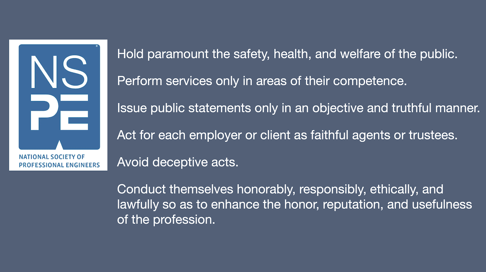
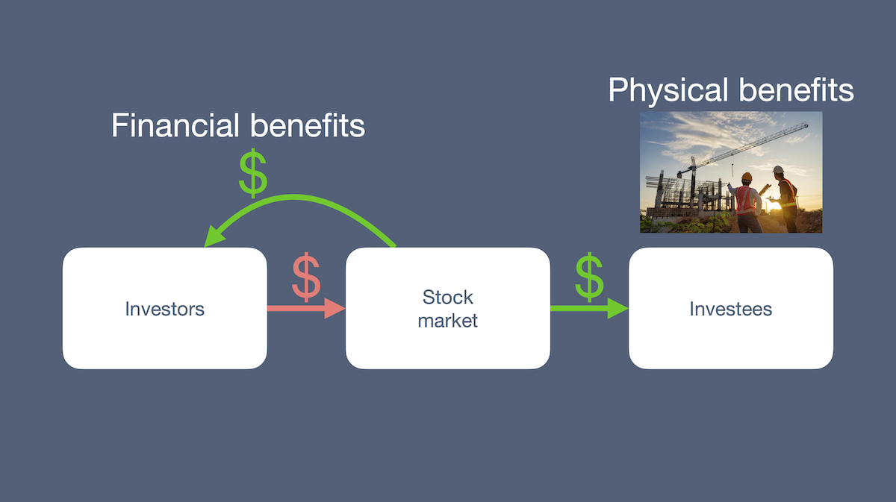
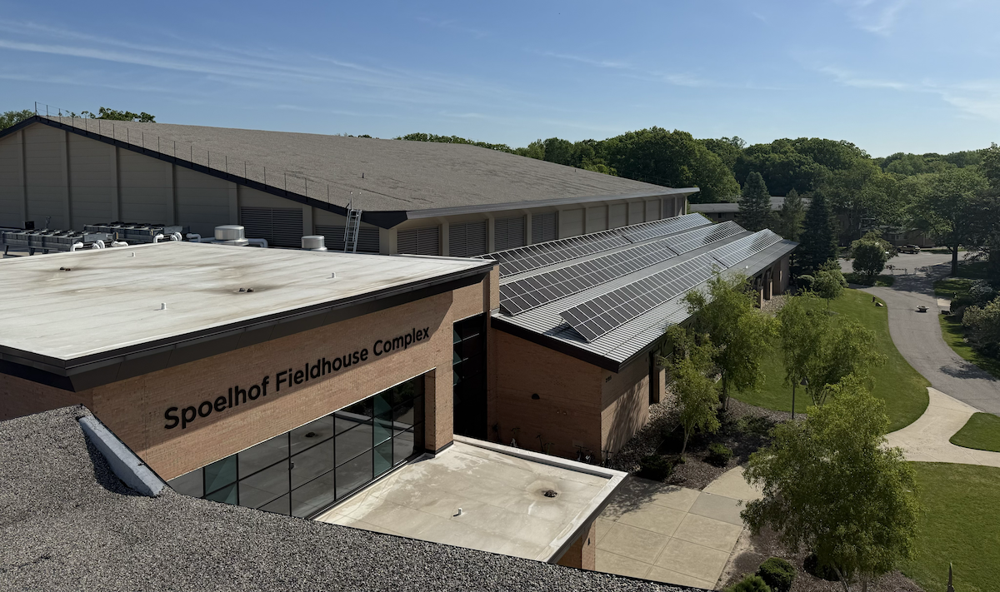

# Redemption

If engineering design is so fraught with 
the Fall, 
human finitude, and 
the problem of scale, 
you might be wondering how we engineers design anything 
that serves intended purposes 
to solve problems 
in the concrete, tangible world we inhabit. 
There are several ways, 
each of which is a manifestation 
of [common grace](https://en.wikipedia.org/wiki/Common_grace).

## Overcoming the Fall

First, to overcome the problems of 
dishonesty, evil, and the Fall, 
we have codes of ethics. 
Ethics is Randy's topic for tomorrow’s keynote, and
I'm eager for it! 
For now, I note that the 
National Society of Professional Engineers code of ethics
holds that engineers, 
in the fulfillment of their professional duties, 
shall do these six things.

{fig-alt="National Society of Professional Engineers code of ethics."}

Codes of ethics are necessary but not sufficient 
for doing engineering well.

## Overcoming human finitude

Next, 
there are several ways we attempt to overcome 
the problem of human finitude. 
First, we design bigger and stronger than our models say we need, 
just in case the material is flawed or not as strong as we expect or 
the loads are larger than we imagined. 
We quantify how much bigger or stronger by a multiplier, 
the safety factor. 

We also use margin (reserved, mass, power, volume, or money) 
to address challenges that arise during the design process. 
Safety factors and margin guard against things 
in the concrete, tangible world 
being different from the abstract, symbolic space. 

We use the review process to hopefully catch problems 
before going into production.

A second example is building codes.

A third example is 
[design norms](https://www.amazon.com/Responsible-Technology-Mr-Stephen-Monsma/dp/0802801757/ref=sr_1_1?dib=eyJ2IjoiMSJ9.f0z57w8W5cijyw_-aa59Vmihxl2x_SsYVxDQiUl5q52dbkoJbJfRsCz0dIt4oKmHUWehLedeaD1TwJb53ZJAqfMCGsCsTmRbShvipe7fR85a-IXBiqGYy2vgkFUVRevFDDtCA9P2MOHqrMpM50si9FfHNPw866flhEUv4s3WBHLY-XfGIUFvyM2xOEbG-0JnltpPN76XUsXjFdaisxnOX3SNpkUZEO1-zyFWGRAXMX0.NFcC-N1lSgCcCl6J_su02HUVliW7F1v1eEWhey6C2iw&dib_tag=se&keywords=responsible+technology&qid=1780868490&sr=8-1)
which encourage designers to consider 
many factors in their work. 
Perhaps you can think of more ways 
we guard against human finitude.

.](images/overcoming-problems.png){fig-alt="Overcoming human finitude."}

## Overcoming the problem of scale

Finally, what about the problem of scale? 
Evidence shows that we have not yet solved 
the problem of scale, and, unfortunately, 
I don’t have an answer here. Nobody does.

In my observation, 
most engineers work at the micro level and are heads down 
to design and manufacture the next product, 
stay ahead of the competition, and 
solve today’s problems. 
There is rarely time to consider the problem of scale. 
In fact, as I noted before, 
many incentives point in the opposite direction from a solution. 
I don’t think we can expect individuals or firms, 
to solve the problem of scale at the micro level.

In education, we engineering professors are heads down 
teaching students to avoid evil and guard against human finitude. 
We teach 
codes of ethics, 
safety factors, 
margins, 
reviews, and 
design norms, 
all aimed at solving micro level problems. 
Sadly, very few engineering textbooks 
discuss the problem of scale or the macro level at all. 
So I don't think we can expect the education system 
as presently constituted to solve the problem of scale. 

Rather, the problem of scale is a macro level, systemic problem. 
And macro level, systemic problems need 
macro level, systemic solutions. 
I and others contend that the problem of scale 
is a governance issue at the macro level. 

](images/blue-marble.png){fig-alt="The problem of scale is a governance issue at the macro level."}

Unfortunately, few of us work at the macro level, 
maybe only national leaders or UN ambassadors. 
But even they have narrow constituencies, 
their citizens. 
To within rounding error, no one with any power
operates at the global level with the nonhuman creation 
as their constituency. 

So, is it any wonder that we are inside-outing the planet 
to run our economies?

If the problem of scale can't be solved at the micro level, 
where most engineers work and where education is focused, 
is there any role for us? 
I think there is. 

Practicing engineers can be laying the groundwork 
for the day when actors at the macro level are 
ready to meaningfully address the problem of scale. 
Individual engineers can use their creativity and designing 
to point in redemptive directions. 
We can make our moves from the concrete, tangible world 
to the abstract, symbolic space, and back again 
to bring about the flourishing 
of the non-human creation rather than its domination, 
if only at the micro level for now. 

Engineering educators can point in redemptive directions, too, 
by exposing students to the problem of scale and 
the inside-outing of the planet 
in addition to teaching about the problems 
of evil and human finitude.

When all of us interact with the macro level, 
say when we vote, 
we can express our preferences that 
macro-level people and institutions 
start addressing the problem of scale sooner rather than later. 
Further, we can point in directions society needs to move,
often called Earthkeeping, Creation Care, or Sustainability.

Perhaps some of you are thinking that macro level systems 
are comprised of many smaller systems. 
And you’re right! 
In fact, we are embedded in systems within systems 
in families, at work and church, in the university and the city. 
We can begin learning and teaching the skills 
to affect those micro and meso systems in positive ways today, 
again in preparation for the day 
that macro-level people begin addressing the problem of scale.

Although you might not have known it, 
if you walked past the Van Noord arena and 
looked up to the roof, 
you will have seen an example of such redemptive system change
on this very campus. 
There is a lot more going on here besides 
new PV panels on the roof!

.](images/van-noord-lower-roof-pv-panels.jpg){fig-alt="Solar panel installation on the lower roof of the Van Noord arena." width=80%}

In Fall 2024, 
I posed the question 
"[w]hat should be the design of a Calvin solar farm?"
to the students in my senior-level 
_Design of Thermal Systems_ class, 
on our campus numbered ENGR333. 
The customer for their work was the university CFO. 

.](images/fall2024-engr333.png){fig-alt="Fall 2024 ENGR333 students."}

Together, the students, the customer, and I 
did a deep re-thinking of long-held assumptions 
about the way some financial and university systems work. 
First, we had to realize that every investment has financial 
and physical benefits. 
All investors, including university endowments, 
participate in "the market" 
to accrue financial benefits. 
But all investments 
find their way to investees who accrue physical benefits, 
say in the form of a new factory. 

{fig-alt="Investing has financial and physical benefits."}

Second, 
Calvin had to re-envision the purpose of university endowments 
and how they operate. 
What if instead of investing in the market, 
we invest in ourselves by using endowment money 
to purchase solar panels? 
We could get the financial benefits, sure, 
in the form of reduced electricity bills. 
But we could also accrue the physical benefits 
of reduced reliance on the grid and reduced CO~2~ emissions. 

{fig-alt="Investing in ourselves to accrue both financial and physical benefits."}

After the semester, 
several students made 
additional presentations to the board of trustees, 
challenging them, in the friendliest possible way, 
to use endowment money to invest in ourselves rather than the market. 

 and [Calvin University](https://gallery.calvin.edu/Academics/Science-Technology-Engineering-Mathematics/Engineering/ENGR-333-Presentation-2024-Fall/i-SMcHmc7/A).](images/engr333-student-presentations.png){fig-alt="ENGR333 student presentations."}

They were persuasive! 
Calvin University will use electricity cost savings 
to pay back the endowment with interest. 
Financial returns to the endowment 
will be less than a roaring year for the stock market. 
But more consistent and never negative. 
The presence of these solar panels on this campus 
will not solve the problem of CO~2~ emissions at the macro level. 
But this type of systemic change at the micro level 
can be seen as a prototype for systemic change 
at the macro level.

Thus, we see that _imago Dei_ has more depth than 
"human creativity reflecting God the Father."
At our best, we designers can be pointing 
in redemptive directions as well, 
reflecting God, the Son, our redeemer, and 
the redeemer of the whole groaning creation!

{fig-alt="Van Noord Arena solar panels installed on lower roof." width=80%}

So one last time. Engineering: what are we doing?

At our best, we engineers overcome the effects 
of the Fall and human finitude 
to design objects that solve problems, 
point in redemptive directions, and 
prepare to address the problem of scale.

